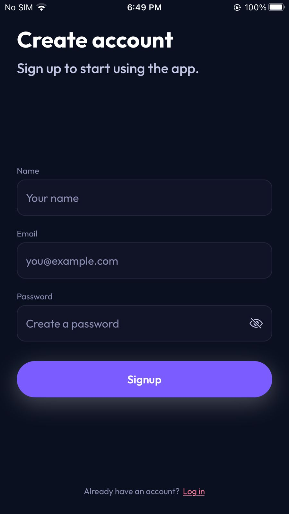
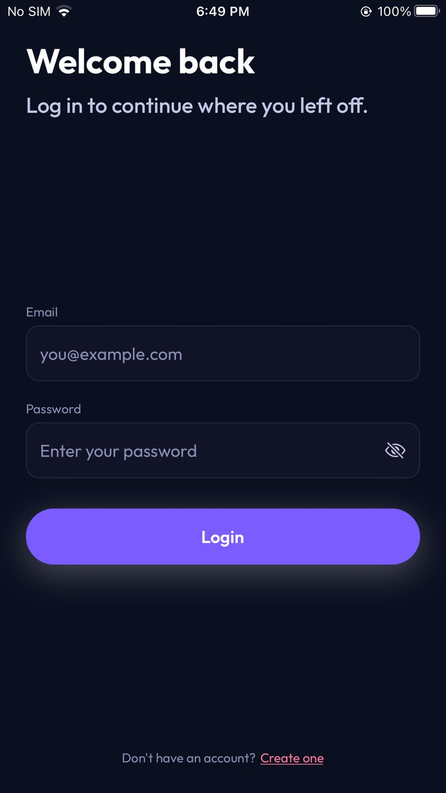

## User Authentication App

This React Native app implements a clean, scalable authentication flow using **React Context API**, **React Navigation**, and **AsyncStorage**. It supports multi-user signup, login, and logout with a polished UI and custom typography.

### Features

- **AuthContext with Context API**
  - `login`, `signup`, and `logout` functions
  - `user` and `isLoading` state
  - Multi-user support backed by AsyncStorage
  - Persists the currently logged-in user across app restarts
- **Screens**
  - `Login` – email/password login with validation and error messages
  - `Signup` – name/email/password signup with validation and unique email enforcement
  - `Home` – shows the logged-in user’s name + email and provides a logout action
- **Navigation**
  - `@react-navigation/native` + `@react-navigation/native-stack`
  - Auth-aware root navigator:
    - Shows `Login` / `Signup` when logged out
    - Shows `Home` when logged in
  - **Custom Hooks**: Abstracted business logic out of screens into `useLoginForm` and `useSignupForm` to keep components strictly responsible for UI.
- **UI / UX**
  - Centralized `theme` with colors, spacing, typography, radius, and shadows
  - Reusable components (`Typography`, `PrimaryButton`, `TextField`, `ScreenContainer`)
  - Smooth Keyboard avoidance and screen scrolling on Auth forms (`KeyboardAwareScrollView` and flexGrow).
  - Password visibility toggle (eye icon) on password fields

### Screenshots

<p align="center">
  
  
  
</p>

### Project Structure

```text
src/
  components/
    PrimaryButton.tsx
    ScreenContainer.tsx
    TextField.tsx
    Typography.tsx
  constants/
    validation.ts
  context/
    AuthContext.tsx
  hooks/
    useLoginForm.ts
    useSignupForm.ts
  navigation/
    RootNavigator.tsx
  screens/
    HomeScreen.tsx
    LoginScreen.tsx
    SignupScreen.tsx
  theme/
    colors.ts
    index.ts
    spacing.ts
    typography.ts
  types/
    index.ts
App.tsx
react-native.config.js
```

### Dependencies

Core runtime dependencies added:

- `@react-native-async-storage/async-storage`
- `@react-navigation/native`
- `@react-navigation/native-stack`
- `react-native-safe-area-context`
- `react-native-screens`
- `react-native-vector-icons`
- `react-native-keyboard-aware-scroll-view`

### Setup & Installation

1. **Install dependencies**

```bash
pnpm install
# or
npm install
```

2. **iOS specific: install pods**

```bash
cd ios
pod install
cd ..
```

3. **Run the app**

```bash
npm run ios
# or
npm run android
```

### How Authentication Works

- **User storage**
  - All registered users are stored in AsyncStorage under the `@app_users` key.
  - Passwords are kept in plain text **only for this assessment** (no backend). In a real app, passwords must be hashed and never stored in plain text.
- **Current user**
  - The currently authenticated user (without password) is stored under `@app_current_user`.
  - On app startup, `AuthProvider` reads this key and restores the session if present.
- **Signup flow**
  - Validates name, email format, and password length (min from `validationRules`).
  - Enforces unique email (case-insensitive) and shows a friendly “email already exists” message.
  - On success, the new user is saved and an alert is shown. The user is then navigated back to the `Login` screen to log in with their new credentials.
- **Login flow**
  - Validates email format and non-empty password.
  - Checks credentials against stored users.
  - On incorrect credentials, shows a specific error message.

### Validation Rules

Validation-related values and messages are centralized in `src/constants/validation.ts`:

- `validationRules.password.minLength`
- `validationMessages.email.invalid`
- `validationMessages.password.*`
- `validationMessages.name.required`
- `validationMessages.auth.*`

This is a new [**React Native**](https://reactnative.dev) project, bootstrapped using [`@react-native-community/cli`](https://github.com/react-native-community/cli).
